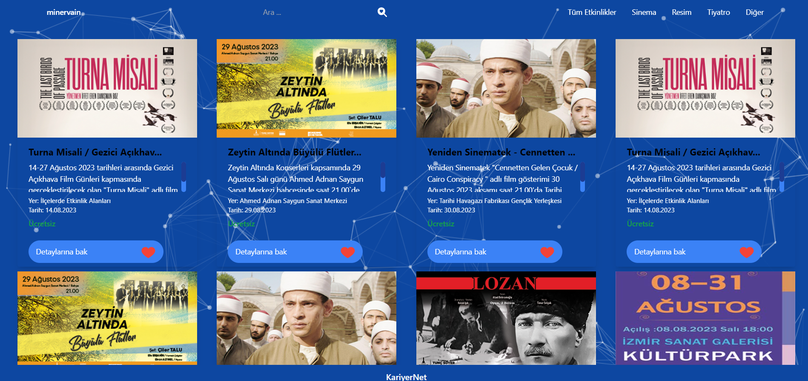
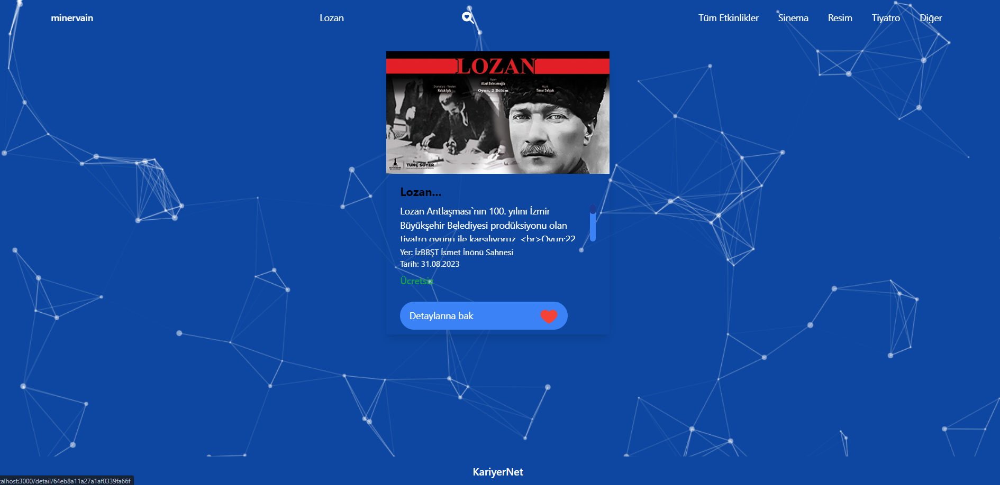
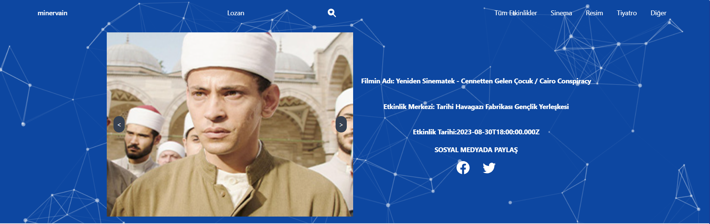
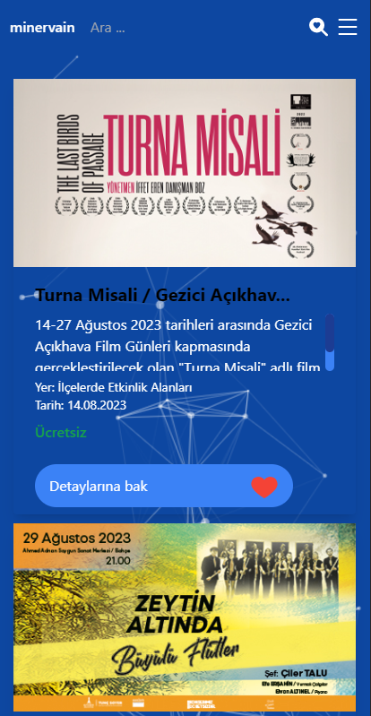

# MERN EVENT PROJECT

İzmir Büyükşehir belediyesinin bazı verilerini kullanarak hazırladığım apisini kendim oluşturduğum etkinlik arama ve konumunu bulma projesi
## Teknolojiler

Bu projede aşağıdaki teknolojileri kullanarak geliştirme yapıldı:

- **React**: Kullanıcı arayüzünü oluşturmak için React kütüphanesi kullanıldı.
- **React Redux**: Uygulama durumunun yönetimi için Redux kullanıldı.
- **GoogleMaps**:Konum bulmak için googlemaps api kullanıldı.
- **Tailwind**:Stillendirmeler için kullanıldı.
- **CustomHook**:Proje için custom hook yazıldı.
- **Responsive**:Responsive Tasarıma uygun yazıldı.
- **React Router**: Sayfa yönlendirmeleri için React Router kullanıldı.
- **React Icons**: Görsel ikonlar için React Icons kütüphanesi kullanıldı.
- **SCSS**: Projede stil ve tasarım için SCSS kullanıldı.
- **Express**: Sunucu tarafı işlemler için Express kullanıldı.
- **MongoDB**: Veritabanı olarak MongoDB kullanıldı.
- **Mongoose**: MongoDB ile etkileşim kurmak için Mongoose kullanıldı.
- **Çeşitli Middleware'ler**: Express uygulamasına eklenen çeşitli middleware'ler kullanıldı (örneğin, oturum yönetimi, güvenlik vb.).

## Nasıl Çalıştırılır ?

1. Projeyi bilgisayarınıza klonlayın: `git clone https://github.com/sizin-kullanici-adi/sizin-proje-adiniz.git`
2. Proje klasörüne gidin: `cd sizin-proje-adiniz`
3. Gerekli bağımlılıkları yüklemek için: `npm install`
4. Uygulamayı başlatmak için: `npm start`

<h1>Proje Resimleri </h1>

